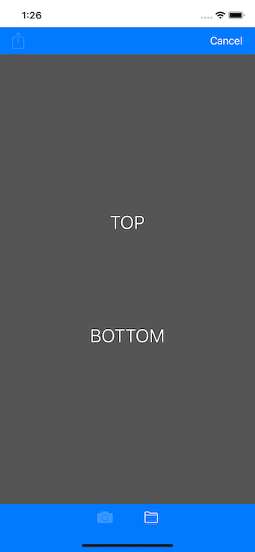
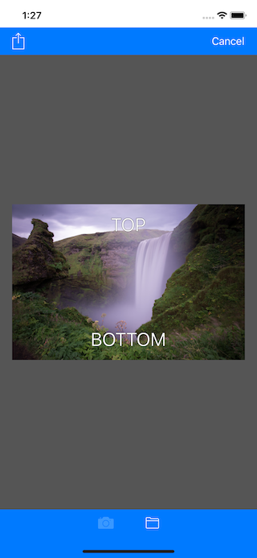
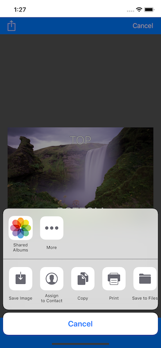
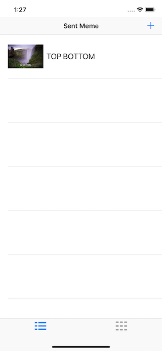

# YSMemeMe v1.0 - v2.0
An iOS app created as part of my first project in the iOS Nanodegree program ( MemeMe )

---------------------------------------------------------------------------------------------
## What is MemeME
This application allows you to bring a photo from the picture library or take a new image from the camera and then write and publish it in social networking sites or by messages

  
 

## Compatibility
Swift 4

## Problems?
Send me an [email](mailto:arabphone.sa@gmail.com) if you encounter any problems.

## Credits
Original graphical assets were provided by Udacity.
The concept for this app was presented during the iOS Nanodegree programme provided by Udacity.

## License
Freely provided under [The MIT License](https://en.wikipedia.org/wiki/MIT_License).

